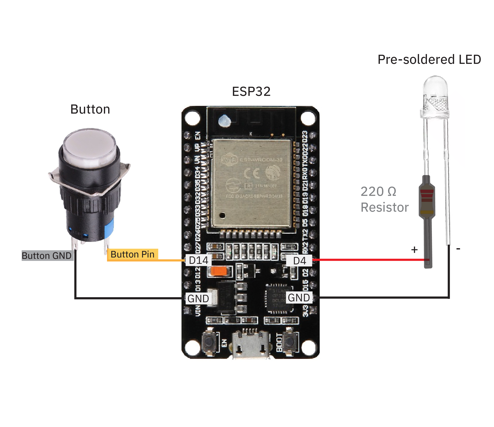

# Siggraph Experience Lab: Build Your Own IoT Love Messengers!
by Julia Daser and Pepi Ng
 
 
**Workshop 1:** Tuesday, 30 July 2024, 3:00PM - 5:00PM
 
**Workshop 2:** Wednesday, 31 July 2024, 11:15AM - 1:15PM
 

## Contact us
We hope you guys had tons of fun building these DIY Love Messengers as much as we did! 💙🧡   
If you run into any issues, please reach out to us!! We would love to help
 
#### Email:  yiqing.ng@gmail.com
#### Instagram: [@julia.daser](https://www.instagram.com/julia.daser/)

Follow us on [our YouTube channel](https://www.youtube.com/@WormiCollective)
 

## This Github Page Contains
- 3D models of the box encasing, the floor, and the hearts for 3D-printing
- The Code for the ESP32 Microcontrollers
- The Class-Slides
- The Slides on how to Create a Database
- coming soon... the Slides on how to Upload the ESP32 Code

## About 
Welcome to your hands-on workshop at Siggraph 2024! Today, you are making your very own pair of DIY Love Messengers! 
 
 
Our DIY Love Messengers are the perfect gift for your friends/ partners, especially long-distance ones! When the button of one love messenger is pressed, both of them will light up - no matter HOW FAR AWAY the two messengers are! We will be using all the files, code and 3D models from this repository in the SIGGRAPH workshop.
 
 

 
 

## Materials provided in your kit for TWO Love Messengers
1. 4x 3D-printed translucent hearts **halves** (see '3D models' folder)
2. 2x 3D-printed box encasings (see '3D models' folder)
3. 2x 3D-printed box floors (see '3D models' folder)
4. 2x [16mm pre-soldered illuminated push buttons](https://www.aliexpress.us/item/2251832614629523.html?spm=a2g0o.productlist.main.11.5072117655K7gB&algo_pvid=225969aa-799d-4e9d-af17-dd443563b8c6&algo_exp_id=225969aa-799d-4e9d-af17-dd443563b8c6-5&pdp_npi=4%40dis%21USD%210.62%210.62%21%21%210.62%210.62%21%40210307c317161401282835369e4f5f%2165823672908%21sea%21US%210%21AB&curPageLogUid=AgGRJrNgn8u5&utparam-url=scene%3Asearch%7Cquery_from%3A) ($0.62 per)
5. 2x [pre-soldered Super bright LEDs](https://www.amazon.com/dp/B01AUI4VQU/ref=sspa_dk_detail_4?pd_rd_i=B01AUI4VQU&pd_rd_w=YnDHQ&content-id=amzn1.sym.248b5e31-60e8-4934-96cf-b3789198461a&pf_rd_p=248b5e31-60e8-4934-96cf-b3789198461a&pf_rd_r=0NJCFTT68WD09JGSG2HB&pd_rd_wg=p8EFN&pd_rd_r=797c86d4-d6a1-4a3a-b51a-dba9e538c45a&s=hi&sp_csd=d2lkZ2V0TmFtZT1zcF9kZXRhaWxfdGhlbWF0aWM&th=1) (Pre-soldered with resistors) ($5.99 for 100)
6. 4x [M2.5 x 10 mm Screws](https://www.amazon.com/uxcell-100pcs-Stainless-Phillips-Tapping/dp/B01KXTUCM8/ref=sr_1_1_sspa?crid=1A0H7ME44I8XG&dib=eyJ2IjoiMSJ9.1EDcmIzZvaAscU3Q-1ZO17pntsZAfotkye6Xwgxa5MQWk30NrBFC_MF6IROeWOjLtfmwox328E3DkG8CdnVfezLs6Xb8RNRxMYqVslyaOu7hm3xB4WrDxBira7h0NvUAXxpph7wWM13UlfpV83F09FYsV4QALO0P2KET0VfsBjRP6IfLUAXQQszT4pUiwVfxoMEFR5iH1uEIA9eKS5eNCjoAmmfHzkeT9CZx5lyap4k.YbI_gbR8JlB_4itWpd1EIFg7ybsKn-BVILFg5GIqTQk&dib_tag=se&keywords=m2%2Bx%2B8mm%2Bscrews&qid=1716141059&sprefix=M2%2Bx%2B8mm%2B%2Caps%2C109&sr=8-1-spons&sp_csd=d2lkZ2V0TmFtZT1zcF9hdGY&th=1)
7. 2x [ESP32-WROOM-32 microcontrollers](https://www.getfpv.com/esp32-development-board-w-wifi-bluetooth.html?utm_source=google&utm_medium=cpc&utm_campaign=DM+-+NB+-+PMax+-+Shop+-+No-index+-+SM+-+ALL+%7C+Full+Funnel&utm_content=pmax_x&utm_keyword=&utm_matchtype=&campaign_id=20799936859&network=x&device=c&gc_id=20799936859&gad_source=1&gclid=CjwKCAiAzJOtBhALEiwAtwj8ttuekYgUBbMJGP-JRPyLEPyVTKI_yBnxqm1hygJcPFpiuKzBD8us1hoCmlAQAvD_BwE) ($6.99 per)

    
 

## Tools/ Equipment provided: 
1. Pliers
2. Wire Stripper
3. Small Screwdrivers
4. Soldering Kit
5. USB-MicroUSB wires

 
 

## Wire diagram

 
 

## Try it out yourself at home!
We also made a [tutorial](https://www.youtube.com/watch?v=Ot5ihNqtx74&feature=youtu.be&ab_channel=WormiCollective) so that you can make these Love Messengers again at home. 
   Do note that the materials used for this tutorial is very slightly different from the one we used in the workshop (ie. we randomized the LED colors in the tutorial, but stuck to only one LED color in the SIGGRAPH workshop). You can choose to modify the materials used in the tutorial with the materials outlined in this github repository.
 
 
