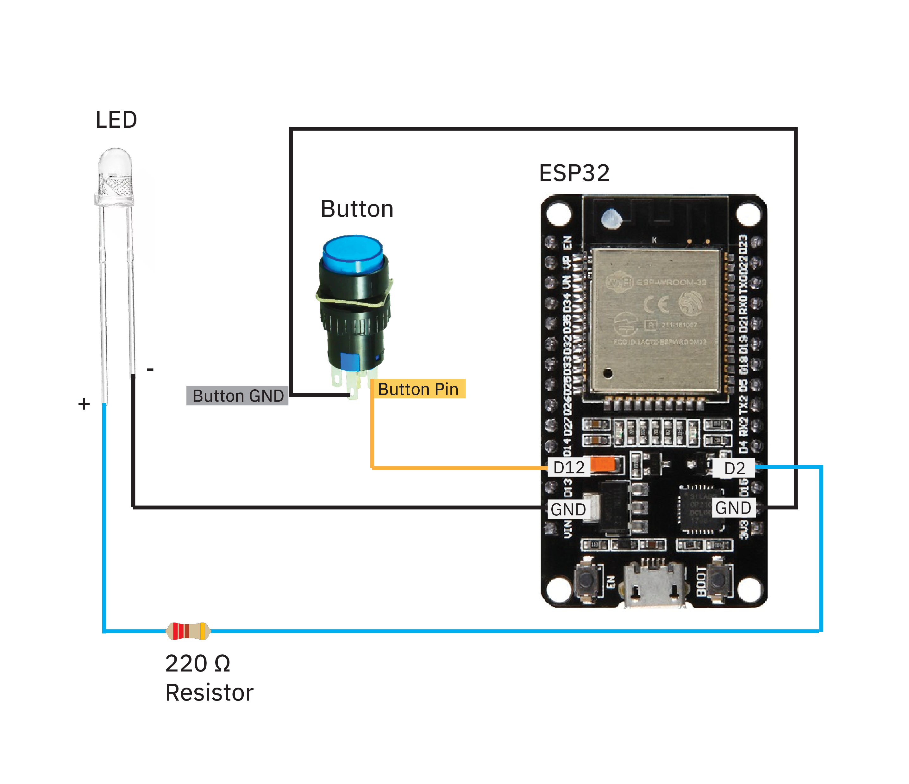

# Siggraph Experience Lab: Build Your Own IoT Love Messengers!
by Julia Daser and Pepi Ng
 
 
**Workshop 1:** Tuesday, 30 July 2024, 3:00PM - 5:00PM
 
**Workshop 2:** Wednesday, 31 July 2024, 11:15AM - 1:15PM
 

## About 
Welcome to your hands-on workshop at Siggraph 2024! Today, you are making your very own pair of DIY Love Messengers! 
 
 
Our DIY Love Messengers are the perfect gift for your friends/ partners, especially long-distance ones! When the button of one love messenger is pressed, both of them will light up - no matter HOW FAR AWAY the two messengers are! We will be using all the files, code and 3D models from this repository in the SIGGRAPH workshop.
 
 

 
 

## Materials provided in your kit for TWO Love Messengers
1. 3D-printed translucent hearts for two (see '3D models' folder)
2. 3D-printed box encasings for two (see '3D models' folder)
3. [16mm illuminated push buttons](https://www.aliexpress.us/item/2251832614629523.html?spm=a2g0o.productlist.main.11.5072117655K7gB&algo_pvid=225969aa-799d-4e9d-af17-dd443563b8c6&algo_exp_id=225969aa-799d-4e9d-af17-dd443563b8c6-5&pdp_npi=4%40dis%21USD%210.62%210.62%21%21%210.62%210.62%21%40210307c317161401282835369e4f5f%2165823672908%21sea%21US%210%21AB&curPageLogUid=AgGRJrNgn8u5&utparam-url=scene%3Asearch%7Cquery_from%3A) ($0.62 per)
4. Some wires 
5. [1/8" Heat shrink tubing](https://www.amazon.com/XHF-Heat-Shrink-Tubing-Roll/dp/B0B38PGS1Y/ref=sr_1_1_sspa?crid=V4VLVPPZZSFX&dib=eyJ2IjoiMSJ9.66H4Hnwp0OvkInhFrpBGyh0zW9x5mQphIGP4V6LXfm6Rcc6P41GnfsAsNUyHBIIWKhjkaK9-p8ej4q1cu1hMXncHQS9X-vDyhRFCOoPWhrOVsVmZbwZ97gytU54qrG3Lx_DREQVYUfl7ImdtfLQDTEMjD9NJkS_rs3PhRXHS-Q0EgzqTAgHyw26n0ZGoTuNNL68y0otdg_TFcaB2l6WeQtd06nlK2a4LtGz---bAg_c.EqoDmAriGWz8E8LrDIZRBhvE_f9yULhHrrcIE9ganRs&dib_tag=se&keywords=1%2F8%2Binch%2Bheat%2Bshrink%2Btubing&qid=1717855275&sprefix=1%2F8%2Binch%2Bheat%2Bshrink%2Btubing%2Caps%2C323&sr=8-1-spons&sp_csd=d2lkZ2V0TmFtZT1zcF9hdGY&th=1) ($9.99 per roll)
6. [Super bright LEDs](https://www.amazon.com/dp/B01AUI4VQU/ref=sspa_dk_detail_4?pd_rd_i=B01AUI4VQU&pd_rd_w=YnDHQ&content-id=amzn1.sym.248b5e31-60e8-4934-96cf-b3789198461a&pf_rd_p=248b5e31-60e8-4934-96cf-b3789198461a&pf_rd_r=0NJCFTT68WD09JGSG2HB&pd_rd_wg=p8EFN&pd_rd_r=797c86d4-d6a1-4a3a-b51a-dba9e538c45a&s=hi&sp_csd=d2lkZ2V0TmFtZT1zcF9kZXRhaWxfdGhlbWF0aWM&th=1) ($5.99 for 100)
7. [2 Micro-USB wires used to power and to transmit data](https://www.bestbuy.com/site/best-buy-essentials-3-usb-a-to-micro-usb-charge-and-sync-cable-black/6456436.p?skuId=6456436&utm_source=feed&ref=212&loc=20161460807&gad_source=1&gclid=CjwKCAiAzJOtBhALEiwAtwj8thVSNr45dY5C1Sd8EiPBhqMn8sO--0ueCs4qPVapoc-a6hkdDCGhWRoCYbwQAvD_BwE&gclsrc=aw.ds) ($4.99 per)
8. [4x M2.5 x 10 mm Screws](https://www.amazon.com/uxcell-100pcs-Stainless-Phillips-Tapping/dp/B01KXTUCM8/ref=sr_1_1_sspa?crid=1A0H7ME44I8XG&dib=eyJ2IjoiMSJ9.1EDcmIzZvaAscU3Q-1ZO17pntsZAfotkye6Xwgxa5MQWk30NrBFC_MF6IROeWOjLtfmwox328E3DkG8CdnVfezLs6Xb8RNRxMYqVslyaOu7hm3xB4WrDxBira7h0NvUAXxpph7wWM13UlfpV83F09FYsV4QALO0P2KET0VfsBjRP6IfLUAXQQszT4pUiwVfxoMEFR5iH1uEIA9eKS5eNCjoAmmfHzkeT9CZx5lyap4k.YbI_gbR8JlB_4itWpd1EIFg7ybsKn-BVILFg5GIqTQk&dib_tag=se&keywords=m2%2Bx%2B8mm%2Bscrews&qid=1716141059&sprefix=M2%2Bx%2B8mm%2B%2Caps%2C109&sr=8-1-spons&sp_csd=d2lkZ2V0TmFtZT1zcF9hdGY&th=1)
9. [2x 220ohm Resistors](https://www.adafruit.com/product/2780) ($0.75 for pack of 25)
10. [2x ESP32-Laptop MicroUSB-USB data transfer wires](https://www.amazon.com/AGIPAXX-Micro-Cable-Cables-Black/dp/B0CZCWD7Q9/ref=sr_1_1_sspa?crid=4LKZUKLQ2U2V&dib=eyJ2IjoiMSJ9.FDY-NaONLUNfYkZ3mhfVZSVwS1xtCw7A9m6LkJJfwdZSku__WoGHVIY5jGTLj0olQF3zz8pWdXopY7JgoPIOTPSiJ5greTiSA26P2D4rirbUnyPe_7YhzVbQ9DnL9eEjZhhZG9M1DgZdiJbb1jbSmrxJk2dYb9PUEmLGkFz5v_na6OrH7M86gx4ADAruGv2qoAjv6aUzn8SshyiFn-aMc-CsDPLU5gmwsZkw-oewL6o.8i84aPyJCKWWLAHO9q27_rEqWPgz6Cj69HsMhTRpu2Y&dib_tag=se&keywords=Micro+USB+Cable%2C+5+Pack&qid=1716141264&sprefix=micro+usb+cable%2C+5+pack%2Caps%2C98&sr=8-1-spons&sp_csd=d2lkZ2V0TmFtZT1zcF9hdGY&psc=1)($12.31 for a pack of 5) 
11. [USBC-USB adapters for Mac users](https://www.amazon.com/Henrety-Adapter-Female-Compatible-MacBook/dp/B0B4S2SKNH/ref=sr_1_3?crid=YCRPTJ7EM00Y&dib=eyJ2IjoiMSJ9.dlxBMmv9mixYqbIbRoCiUutuZGg-05a9clikk9FgGx4eKr6hHk6vOFiPfU3P1ksA-QWp2kF9AWT4ln2FknWtZlPqZGDzz2onlC94TkqnDd-jtviadynjrOUM_z1YYdhI8rO1WY5dbki-J60sVPrdixUuzzUqhN2jQm4UkzHevNfz-Y4ULskbFyi3y3l3Endu7_jcIj-9ZF7HYXWEA_g_FbcWAk5GV1fGPiOUIF0ZJMg.ayPl01xZvZTjLsYFwFhpyVyUUzT8t5nNFOMUG1r13MI&dib_tag=se&keywords=usb%2Bc%2Bto%2Busb&qid=1715897360&sprefix=usbc%2Bto%2Busb%2Caps%2C100&sr=8-3&th=1)($5.59 for a pack of 3)

    
 

## Tools/ Equipment provided: 
1. Pliers
2. Wire Stripper
3. Small Screwdrivers
4. Soldering Kit
5. Heat Gun / Rework station

 
 

## Wire diagram

 
 

## Try it out yourself at home!
We also made a [tutorial](https://www.youtube.com/watch?v=Ot5ihNqtx74&feature=youtu.be&ab_channel=WormiCollective) so that you can make these Love Messengers again at home. 
   Do note that the materials used for this tutorial is very slightly different from the one we used in the workshop (ie. we randomized the LED colors in the tutorial, but stuck to only one LED color in the SIGGRAPH workshop). You can choose to modify the materials used in the tutorial with the materials outlined in this github repository.
 
 

## Contact us
We hope you guys had tons of fun building these DIY Love Messengers as much as we did! 💙🧡
 
Follow us on [our YouTube channel](https://www.youtube.com/@WormiCollective)
 
 
If you have any questions/ feedback, you can also reach us at yiqing.ng@gmail.com.
